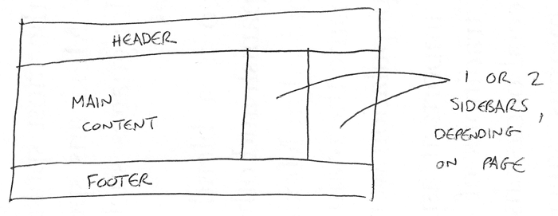

# Berkenalan dengan HTML

## Anatomi elemen HTML

```html
<p>Ini adalah konten</p>
```

Penjelasan anatomi elemen:

- Tag pembuka: Ini terdiri dari nama elemen (dalam contoh ini, p untuk paragraf), dibungkus dengan kurung sudut buka dan tutup.
- Isi: Ini adalah isi dari elemen.
- Tag penutup: Ini sama dengan tag pembuka, kecuali bahwa ia menyertakan garis miring sebelum nama elemen. Ini menandai di mana elemen berakhir

Elemennya adalah tag pembuka, diikuti oleh konten, diikuti oleh tag penutup.

## Elemen bersarang

Elemen dapat ditempatkan di dalam elemen lain. Ini disebut bersarang. Berikut adalah elemen bersarang yang benar dan baik:

```html
<p>My cat is <strong>very</strong> grumpy.</p>
```

## Blok melawan elemen sebaris

- Elemen blok membentuk blok yang memiliki lebar mengikuti lebar halaman. Elemen blok muncul di baris baru mengikut konten yang mendahuluinya. Elemen blok biasanya merupakan elemen struktural pada halama. Misalnya, elemen judul, paragraf, daftar, menu navigasi, atau footer.
- Elemen sebaris memiliki lebar mengikuti isi kontennya dan tidak menyebabkan baris baru muncul. Ini biasanya digunakan dengan teks, misalnya elemen `<a>` membuat hyperlink, dan elemen seperti `<em>` atau `<strong>` membuat penekanan.


## Elemen kosong

Tidak semua elemen mengikuti pola tag pembuka, konten, dan tag penutup. Beberapa elemen terdiri dari satu tag, yang biasanya digunakan untuk menyisipkan/menyematkan sesuatu ke dalam dokumen. Misalnya, elemen `` menyematkan file gambar ke halaman:

```html

```

## Atribut

Atribut berisi informasi tambahan tentang elemen yang tidak akan muncul di konten. Dalam contoh ini, atribut class adalah nama pengenal yang digunakan untuk menargetkan elemen dengan informasi gaya.

Sebuah atribut harus memiliki:

- Spasi antara itu dan nama elemen. (Untuk elemen dengan lebih dari satu atribut, atribut juga harus dipisahkan dengan spasi.)
- Nama atribut, diikuti dengan tanda sama dengan.
- Nilai atribut, dibungkus dengan tanda kutip pembuka dan penutup.

```html
<p class="red-teks">red teks</p>
```

## Atribut Boolean

Atribut Boolean hanya dapat memiliki satu nilai, yang umumnya sama dengan nama atribut.

```html
<input type="text" disabled>
```

## Karakter Kesatuan

Dalam HTML, karakter <, >,",' dan & adalah karakter khusus. Mereka adalah bagian dari sintaks HTML itu sendiri. Untuk mengetahui lebih lanjut tentang referensi entitas, lihat [Daftar referensi entitas karakter XML dan HTML](https://en.wikipedia.org/wiki/List_of_XML_and_HTML_character_entity_references) (Wikipedia).

```html
<p>In HTML, you define a paragraph using the <p> element.</p>

<p>In HTML, you define a paragraph using the &lt;p&gt; element.</p>
```

## Spasi dalam HTML

```html
<p>Dogs are silly.</p>

<p>Dogs        are
         silly.</p>
```

Tidak peduli berapa banyak spasi putih yang Anda gunakan di dalam konten elemen HTML (yang dapat menyertakan satu atau lebih karakter spasi, tetapi juga jeda baris), parser HTML mengurangi setiap urutan spasi putih menjadi satu spasi saat merender kode. Jadi mengapa menggunakan begitu banyak spasi? Jawabannya adalah keterbacaan.

# Metadata di dalam HTML

Head adalah kontainer untuk memberikan informasi pada halaman. Banyak sekali elemen meta yang berisikan atribut nama dan konten: 

- `name` spesifik untuk memberitahukan jenis informasi apa yang dikandungnya.
- `content` menentukan konten meta yang sebenarnya.

Dua elemen meta yang berguna untuk disertakan di halaman Anda menentukan penulis halaman, dan memberikan deskripsi singkat tentang halaman tersebut. Mari kita lihat sebuah contoh:

```html
<meta name="author" content="Chris Mills">
<meta name="description" content="The MDN Web Docs Learning Area aims to provide
complete beginners to the Web with all they need to know to get
started with developing web sites and applications.">
```

Menentukan deskripsi yang menyertakan kata kunci yang berkaitan dengan konten halaman Anda berguna karena berpotensi membuat halaman Anda muncul lebih tinggi dalam pencarian relevan yang dilakukan di mesin pencari (aktivitas seperti itu disebut Search Engine Optimization, atau SEO.) 

Berikut adalah metadata eksklusif, yang dirancang untuk menyediakan situs tertentu:

- [Open Graph Data](https://ogp.me/) adalah protokol metadata yang diciptakan Facebook.
- [Twitter Cards](https://developer.twitter.com/en/docs/twitter-for-websites/cards/overview/abouts-cards), adalah protokol metadata yang diciptakan Twitter.
- [Metatags](https://metatags.io/), adalah alat untuk melihat konten yang tampil di website sepert Google, Facebook, dll.

# Teks HTML

Sebagian besar teks terstruktur terdiri dari judul dan paragraf, apakah Anda membaca cerita, koran, buku teks perguruan tinggi, majalah, dll.

Ada enam elemen heading: `<h1>`, `<h2>`, `<h3>`, `<h4>`, `<h5>`, dan `<h6>`. Setiap elemen mewakili tingkat konten yang berbeda dalam dokumen; `<h1>` mewakili heading utama, `<h2>` mewakili subheading, `<h3>` mewakili sub-subheading, dan seterusnya. Berikut beberapa praktik terbaik:

- Sebaiknya, Anda harus menggunakan satu `<h1>` per halaman—ini adalah judul tingkat atas, dan yang lainnya berada di bawah ini dalam hierarki.
- Pastikan Anda menggunakan judul dalam urutan yang benar dalam hierarki. Jangan gunakan elemen `<h3>` untuk mewakili subjudul, diikuti oleh elemen `<h2>` untuk mewakili sub-subjudul—itu tidak masuk akal dan akan menyebabkan hasil yang aneh.
- Disarankan heading tidak lebih dari tiga per halaman. Karena dokumen dengan banyak level (misalnya, hierarki heading yang dalam) menjadi berat dan sulit dinavigasi. Pada kesempatan seperti itu, disarankan untuk menyebarkan konten ke beberapa halaman jika memungkinkan.

## Mengapa kita membutuhkan struktur?

- Pengguna yang melihat halaman web cenderung memindai dengan cepat untuk menemukan konten yang relevan, seringkali hanya membaca judulnya.
- Mesin pencari yang mengindeks halaman Anda menganggap isi heading sebagai kata kunci penting untuk mempengaruhi peringkat pencarian halaman. Tanpa heading, halaman Anda akan berkinerja buruk dalam hal SEO (Search Engine Optimization).
- Orang dengan gangguan penglihatan yang parah sering tidak membaca halaman web, mereka mendengarkan mereka sebagai gantinya. Ini dilakukan dengan perangkat lunak yang disebut pembaca layar. Di antara berbagai teknik yang digunakan, mereka memberikan garis besar dokumen dengan membacakan judul, memungkinkan pengguna mereka untuk menemukan informasi yang mereka butuhkan dengan cepat. Jika judul tidak tersedia, mereka akan dipaksa untuk mendengarkan seluruh dokumen dibacakan dengan lantang.
- Untuk memberikan gaya menggunakan CSS, membutuhkan elemen yang membungkus yang relevan, sehingga CSS/JavaScript dapat menargetkannya secara efektif.

## Mengapa kita membutuhkan semantik?

Semantik diandalkan di mana-mana di sekitar kita-kita mengandalkan pengalaman sebelumnya untuk memberi tahu kita apa fungsi objek sehari-hari, ketika kita melihat sesuatu, kita tahu apa fungsinya. Gampangnya semantik adalah makna, setiap element pada HTML memiliki makna. 

Keutungan menggunakan semantik dengan benar dan baik: 

- Baik untuk SEO dan alat pembayar layar.
- Mempermudah programmer untuk membaca dan memakainya.

## Daftar

### Unordered

Daftar tidak berurutan digunakan untuk menandai daftar item yang urutan itemnya tidak penting.

```html
<ul>
  <li>milk</li>
  <li>eggs</li>
  <li>bread</li>
  <li>hummus</li>
</ul>
```

### Ordered

Daftar yang dipesan adalah daftar yang urutan itemnya penting.

```html
<ol>
  <li>Drive to the end of the road</li>
  <li>Turn right</li>
  <li>Go straight across the first two roundabouts</li>
  <li>Turn left at the third roundabout</li>
  <li>The school is on your right, 300 meters up the road</li>
</ol>
```

# Tekanan dan penting

- `<em>` digunakan untuk menekankan kata-kata tertentu untuk mengubah arti kalimat, dan kita sering ingin menandai kata-kata tertentu sebagai penting atau berbeda dalam beberapa hal.
- `<strong>` digunakan untuk menekankan kata-kata penting, kita cenderung menekankannya dalam bahasa lisan dan menebalkannya dalam bahasa tulisan.
- `<b>` digunakan untuk menyampaikan makna yang secara tradisional disampaikan dengan huruf tebal: kata kunci, nama produk, kalimat utama.
- `<i>` digunakan untuk menyampaikan makna yang secara tradisional disampaikan dengan huruf miring: kata asing, penunjukan taksonomi, istilah teknis, pemikiran.
- `<u>` digunakan untuk menyampaikan makna yang secara tradisional disampaikan dengan menggaris bawahi: nama diri, salah eja.

# Hyperlinks

Hyperlink memungkinkan untuk menautkan dokumen ke dokumen atau sumber lain, menautkan ke bagian dokumen tertentu, atau membuat aplikasi tersedia di alamat web.

```html
<a href="https://www.google.com">Link to Google</a>
```

Berikut adalah penjelasan atribut-atributnya:

- `title` digunakan untuk memberikan informasi tambahan tentang tautan.
- `target` digunakan untuk menentukan tempat untuk membuka dokumen tertaut.

## Blokir tautan

Membungkus gambar menggunakan link:

```html
<a href="https://www.mozilla.org/en-US/">
  
</a>
```

## Direktori

```html
<p>Visit my <a href="../projects/index.html">project homepage</a>.</p>
```

- Direktori yang sama menyertakan isinya, misalnya `index.html`
- Pindah ke subdirektori menyertakan direktorinya, misalnya `projects/index.html`
- Untuk menuju direktori induk atau menaik direktori, gunakan `../`

## Fragmen dokumen

Memungkinkan kita menautkan ke bagian tertentu dari dokumen HTML, berdasarkan atribut `id` pada elemen tertentu. Contoh:

```html
<p>Want to write us a letter? Use our 
	<a href="contacts.html#Mailing_address">mailing address</a>.
</p>

<h2 id="Mailing_address">Mailing address</h2>
```

Anda bahkan dapat menggunakan referensi fragmen dokumen sendiri untuk menautkan ke *bagian lain dari dokumen saat ini* :

```html
<p>
	The <a href="#Mailing_address">company mailing address</a> 
	can be found at the bottom of this page.
</p>
```

## Tautan Praktik Terbaik

- Pengguna pembaca layar suka melompat-lompat dari tautan ke tautan di halaman, dan membaca tautan di luar konteks.
- Mesin pencari menggunakan teks tautan untuk mengindeks file target, jadi sebaiknya sertakan kata kunci dalam teks tautan Anda untuk menjelaskan secara efektif apa yang ditautkan.
- Pembaca visual menelusuri halaman daripada membaca setiap kata, dan mata mereka akan tertuju pada fitur halaman yang menonjol, seperti tautan. Mereka akan menemukan teks tautan deskriptif berguna.

Mari kita lihat contoh spesifik:

```html
<!-- Good -->
<p><a href="https://www.mozilla.org/firefox/">
  Download Firefox
</a></p>

<!-- Bad -->
<p><a href="https://www.mozilla.org/firefox/">
  Click here
</a>
to download Firefox</p>
```

- Jangan ulangi URL sebagai bagian dari teks tautan — URL terlihat jelek, dan terdengar lebih jelek saat pembaca layar membacanya huruf demi huruf.
- Jangan katan “tautan” atau “tautan ke” di teks tautan, karena secara pengguna visual tau bahwa itu adalah tautan.
- Buat teks tautan sesingkat mungkin.
- Minimalkan salinan teks yang sama ditautkan ke tempat yang berbeda, dapat menyebabkan masalah bagi pengguna membaca, seperti : “klik di sini”, “klik di sini”.

## Menautkan ke sumber daya non-HTML

Saat menautkan ke sumber daya yang akan diunduh (seperti dokumen PDF atau Word), streaming (seperti video atau audio), atau memiliki efek lain yang berpotensi tidak terduga (membuka jendela sembulan, atau memuat film Flash), Anda harus menambahkan kata-kata yang jelas untuk mengurangi kebingungan.

Sebagai contoh:

- Jika Anda menggunakan koneksi bandwidth rendah, klik tautan, lalu unduhan beberapa megabita dimulai secara tidak terduga.
- Jika Anda belum menginstal Flash player, klik tautan, dan kemudian tiba-tiba dibawa ke halaman yang membutuhkan Flash.

Mari kita lihat beberapa contoh, untuk melihat jenis teks apa yang dapat digunakan di sini:

```html
<p><a href="https://www.example.com/large-report.pdf">
  Download the sales report (PDF, 10MB)
</a></p>

<p><a href="https://www.example.com/video-stream/" target="_blank">
  Watch the video (stream opens in separate tab, HD quality)
</a></p>

<p><a href="https://www.example.com/car-game">
  Play the car game (requires Flash)
</a></p>
```

## Unduhan

Saat Anda menautkan ke sumber daya yang akan diunduh daripada dibuka di browser, Anda dapat menggunakan `download` atribut untuk memberikan nama file simpan default. Berikut ini contoh dengan tautan unduhan ke Firefox versi Windows terbaru:

```html
<a href="https://download.mozilla.org/?product=firefox-latest-ssl&os=win64&lang=en-US"
   download="firefox-latest-64bit-installer.exe">
  Download Latest Firefox for Windows (64-bit) (English, US)
</a>
```

## Link Email

Dimungkinkan untuk membuat tautan atau tombol yang, ketika diklik, membuka pesan email keluar baru daripada menautkan ke sumber daya atau halaman. Ini dilakukan dengan menggunakan `[<a>](https://developer.mozilla.org/en-US/docs/Web/HTML/Element/a)` elemen dan `mailto:` skema URL.

```html
<a href="mailto:nowhere@mozilla.org">Send email to nowhere</a>

<a href="mailto:nowhere@mozilla.org?cc=name2@rapidtables.com&bcc=name3@rapidtables.com&subject=The%20subject%20of%20the%20email&body=The%20body%20of%20the%20email">
  Send mail with cc, bcc, subject and body
</a>
```

Berikut adalah beberapa contoh URL mailto lainnya:

- [mailto:](mailto:)
- [mailto:nowhere@mozilla.org](mailto:nowhere@mozilla.org)
- [mailto:nowhere@mozilla.org,nobody@mozilla.org](mailto:nowhere@mozilla.org,nobody@mozilla.org)
- [mailto:nowhere@mozilla.org?cc=nobody@mozilla.org](mailto:nowhere@mozilla.org?cc=nobody@mozilla.org)
- [mailto:nowhere@mozilla.org?cc=nobody@mozilla.org&subject=This%20is%20the%20subject](mailto:nowhere@mozilla.org?cc=nobody@mozilla.org&subject=This%20is%20the%20subject)

# Pemformatan Teks Tingkat Lanjut

Untuk mempelajari cara menggunakan elemen HTML yang kurang dikenal untuk menandai fitur semantik lanjutan.

## Daftar Deskripsi

Tujuan dari daftar ini adalah untuk menandai satu set item dan deskripsi yang terkait, seperti istilah dan definisi, atau pertanyaan dan jawaban. Mari kita lihat contoh kumpulan istilah dan definisi:

```html
<dl> <!-- description list -->
  <dt>Lorem ipsum</dt> <!-- description term -->
  <dd> <!-- description definition -->
    Lorem ipsum dolor sit amet consectetur adipisicing elit. In qui
    provident quia asperiores unde magnam debitis reiciendis a totam cum,
    quibusdam nulla enim molestiae earum aut, perferendis quidem, aliquam
    iure.
  </dd>
  <dt>Lorem ipsum</dt>
  <dd>
    Lorem ipsum dolor sit amet consectetur adipisicing elit. In qui
    provident quia asperiores unde magnam debitis reiciendis a totam cum,
    quibusdam nulla enim molestiae earum aut, perferendis quidem, aliquam
    iure.
  </dd>
</dl>

```

## Kutipan

Kutipan dengan mencantumkan sumbernya, contoh: 

```html
<!-- inline quotations -->
<p>The quote element 
	<q cite="https://staging.karirlink.id">
		Lorem ipsum dolor sit amet, consectetur adipisicing elit. Fugiat, saepe!
	</q>
</p>

<!-- quotations -->
<blockquote cite="https://staging.karirlink.id">
  Lorem ipsum dolor sit amet consectetur adipisicing elit. Sit quod nemo maxime? Iure ratione molestiae similique maxime labore dolore tempora?
</blockquote>
```

## Singkatan

Membungkus singkatan atau akronim dan memberikan perluasan penuh istilah, contoh:

```html
<p>We use <abbr title="Hypertext Markup Language">HTML</abbr> to structure our web documents.</p>

<p>I think <abbr title="Reverend">Rev.</abbr> Green did it in the kitchen with the chainsaw.</p>
```

## Alamat

HTML memiliki elemen untuk menandai detail kontak `<alamat>`. Ini membungkus detail kontak Anda, misalnya:

```html
<address>
  <p>
    Chris Mills<br>
    Manchester<br>
    The Grim North<br>
    UK
  </p>

  <ul>
    <li>Tel: 01234 567 890</li>
    <li>Email: me@grim-north.co.uk</li>
  </ul>
</address>
```

## Superskrip dan subskrip

Digunakan untuk menandai item seperti tanggal, rumus kimia dan persamaan matematika, sebagai contoh:

```html
<p>My birthday is on the 25<sup>th</sup> of May 2001.</p>
```

## Mewakili kode komputer

Ada sejumlah elemen yang tersedia untuk menandai kode komputer menggunakan HTML:

- `<code>`: Untuk menandai bagian umum dari kode komputer.
- `<pre>`: Untuk mempertahankan spasi (umumnya blok kode) — jika Anda menggunakan lekukan atau spasi berlebih di dalam teks Anda, browser akan mengabaikannya dan Anda tidak akan melihatnya di halaman yang dirender.
- `<var>`: Untuk menandai nama variabel secara khusus.
- `<kbd>`: Untuk menandai input keyboard (dan jenis lainnya) yang dimasukkan ke dalam komputer.
- `<samp>`: Untuk menandai output program komputer.

```html
<pre><code>var para = document.querySelector('p');

para.onclick = function() {
  alert('Owww, stop poking me!');
}</code></pre>

<p>You shouldn't use presentational elements like <code>&lt;font&gt;</code> and <code>&lt;center&gt;</code>.</p>

<p>In the above JavaScript example, <var>para</var> represents a paragraph element.</p>

<p>Select all the text with <kbd>Ctrl</kbd>/<kbd>Cmd</kbd> + <kbd>A</kbd>.</p>

<pre>$ <kbd>ping mozilla.org</kbd>
<samp>PING mozilla.org (63.245.215.20): 56 data bytes
64 bytes from 63.245.215.20: icmp_seq=0 ttl=40 time=158.233 ms</samp></pre>
```

## Menandai waktu dan tanggal

HTML juga menyediakan elemen **`<time>` untuk menandai waktu dan tanggal dalam format yang dapat dibaca mesin. Sebagai contoh:

```html
<!-- Standard simple date -->
<time datetime="2016-01-20">20 January 2016</time>
<!-- Just year and month -->
<time datetime="2016-01">January 2016</time>
<!-- Just month and day -->
<time datetime="01-20">20 January</time>
<!-- Just time, hours and minutes -->
<time datetime="19:30">19:30</time>
<!-- You can do seconds and milliseconds too! -->
<time datetime="19:30:01.856">19:30:01.856</time>
<!-- Date and time -->
<time datetime="2016-01-20T19:30">7.30pm, 20 January 2016</time>
<!-- Date and time with timezone offset -->
<time datetime="2016-01-20T19:30+01:00">7.30pm, 20 January 2016 is 8.30pm in France</time>
<!-- Calling out a specific week number -->
<time datetime="2016-W04">The fourth week of 2016</time>
```

# Dokumen dan Struktur Website

Mempelajari cara menyusun dokumen menggunakan tag semantik dan cara menyusun struktur situs web sederhana.

## Bagian dasar dokumen

Halaman web dapat dan akan terlihat sangat berbeda satu sama lain, tetapi semunya cendrung memiliki komponen standar yang serupa, kecuali halaman tersebut menampilkan video atau game layar penuh, merupakan bagian dari semacam proyek seni, atau hanya terstruktur dengan buruk:

- Header
    
    Biasanya strip besar di bagian atas dengan judul besar, logo, dan mungkin tagline. Ini biasanya tetap sama dari satu halaman web ke halaman web lainnya.
    
- Navigation bar
    
    Tautan ke bagian utama situs; biasanya diwakili oleh tombol menu, tautan, atau tab. Seperti header, konten ini biasanya tetap konsisten dari satu halaman web ke halaman web lainnya.
    
- Main content
    
    Area besar di tengah yang berisi sebagian besar konten unik dari halaman web tertentu, misalnya, video yang ingin Anda tonton, atau cerita utama yang Anda baca, atau peta yang ingin Anda lihat, atau berita utama, dll.
    
- Sidebar
    
    Beberapa info periferal, tautan, kutipan, iklan, dll. Biasanya, ini kontekstual dengan apa yang terkandung dalam konten utama (misalnya pada halaman artikel berita, bilah sisi mungkin berisi bio penulis, atau tautan ke artikel terkait) tetapi ada juga kasus di mana Anda akan menemukan beberapa elemen berulang seperti sistem navigasi sekunder.
    
- Footer
    
    Strip di bagian bawah halaman yang umumnya berisi cetakan kecil, pemberitahuan hak cipta, atau info kontak. Ini adalah tempat untuk meletakkan informasi umum (seperti header) tetapi biasanya, informasi itu tidak penting atau sekunder dari situs web itu sendiri. Footer juga terkadang digunakan untuk tujuan SEO, dengan menyediakan tautan untuk akses cepat ke konten populer.
    

"Situs web biasa" dapat disusun seperti ini:


## Elemen tata letak HTML

- `<main>` digunakan untuk konten yang unik satu kali per halaman, dan letakkan langsung di dalam `<body>` dan tidak bersarang di dalam elemen lain.
- `<article>` melampirkan blok konten terkait yang masuk akal sendiri tanpa sisa halaman (misalnya, satu posting blog).
- `<section>` mirip tag article, tetapi lebih untuk mengelompokkan satu bagian halaman yang merupakan satu bagian dari fungsionalitas.
- `<aside>` berisi konten yang tidak terkait langsung dengan konten utama tetapi dapat memberikan informasi tambahan yang terkait secara tidak langsung.
- `<header>` mewakili sekolompok konten pengantar.
- `<nav>` berfungsi navigasi utama pada halaman website.
- `<footer>` mewakili sekompok konten akhir untuk sebuah halaman.

## Pembukus non-semantik

`<span>` adalah elemen non-semantik sebaris, tidak memberikan artisan apapun dan `<div>` elemen non-semantik tingkat blok.

<aside>
⚠️ **Peringatan:** Div sangat nyaman digunakan sehingga mudah digunakan terlalu banyak. Karena mereka tidak membawa nilai semantik, mereka hanya mengacaukan kode HTML Anda. Berhati-hatilah untuk menggunakannya hanya ketika tidak ada solusi semantik yang lebih baik dan cobalah untuk mengurangi penggunaannya seminimal mungkin, jika tidak, Anda akan kesulitan memperbarui dan memelihara dokumen Anda.

</aside>

## Pemutus garis dan aturan horizontal

Dua elemen yang akan Anda gunakan sesekali dan ingin Anda ketahui adalah `[<br>](https://developer.mozilla.org/en-US/docs/Web/HTML/Element/br)`dan `[<hr>](https://developer.mozilla.org/en-US/docs/Web/HTML/Element/hr)`.

## Merencanakan situs web sederhana

Berikut adalah cara merecanakan situs web sederhana dengan beberapa halaman yang cukup sederhana dan menyenangkan.

- Ingatlah bahwa Anda akan memiliki beberapa elemen yang umum untuk sebagian besar (jika tidak semua) halaman — seperti menu navigasi, dan konten footer. Jika situs Anda untuk bisnis, misalnya, sebaiknya informasi kontak Anda tersedia di footer di setiap halaman. Catat kesamaan yang Anda inginkan untuk setiap halaman.
    
    
    
- Selanjutnya, gambar sketsa kasar dari struktur setiap halaman yang Anda inginkan (mungkin terlihat seperti situs web sederhana kami di atas). Perhatikan apa yang akan menjadi setiap blok.
    
    
    
- Sekarang, lakukan brainstorming semua konten lain (tidak umum untuk setiap halaman) yang ingin Anda miliki di situs web Anda — tulis daftar besar.
    
    
    
- Selanjutnya, coba urutkan semua item konten ini ke dalam grup, untuk memberi Anda gambaran tentang bagian mana yang mungkin hidup bersama di halaman yang berbeda. Ini sangat mirip dengan teknik yang disebut [Penyortiran kartu](https://developer.mozilla.org/en-US/docs/Glossary/Card_sorting) .
    
    
    
- Sekarang coba buat sketsa peta situs kasar — buat gelembung untuk setiap halaman di situs Anda, dan gambar garis untuk menunjukkan alur kerja biasa antar halaman. Beranda mungkin akan berada di tengah, dan tertaut ke sebagian besar jika tidak semua yang lain; sebagian besar halaman di situs kecil harus tersedia dari navigasi utama, meskipun ada pengecualian. Anda mungkin juga ingin menyertakan catatan tentang bagaimana hal-hal dapat disajikan.
    
    
    

# Men-debug HTML

HTML bukanlah bahasa pemrograman yang memiliki debugging dan mengoreksi kesalahan setiap kode dituliskan. Web browser akan merender/menampilkan HTML meskipun salah. Berikut adalah alat debugging yang dibuat oleh W3C:

[Markup Validation Service](https://validator.w3.org/)