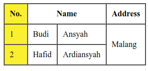

Tabel adalah sekumpulan data terstruktur yang terdiri dari baris dan kolom. Tabel memungkinkan anda dengan cepat dan mudah mencari nilai yang menunjukkan beberapa jenis koneksi antara tipe data yang berbeda, berikut contoh penggunaan tabel:

| Nama | Age |
| --- | --- |
| Hafid | 19 |
| Rifad | 19 |

Syarat menggunakan tabel:

1. Tabel tata letak mengurangi aksesibilitas bagi pengguna tunanetra: karena alat pembaca layar tidak digunakan untuk menafsirkan tag yang ada di HTML dan membacakan isinya kepada pengguna.
2. Tabel menghasilkan sup tag: seperti disebutkan di atas, tata letak tabel umumnya melibatkan struktur markup yang lebih kompleks sehingga mengakibatkan kode menjadi lebih sulit untuk ditulis, dipelihara dan di-debug.
3. Tabel tidak secara otomatis reponsif: tabel secara defualt berukuran sesuai kontennya, sehingga diperlukan tindakan ektra untuk menyesuaian tampilan di berbagai perangkat.

## Penulisan

Berikut beberapa tag pada table:

- `<th>` singkatnya table head, adalah kepala tabel
- `<tr>` singkatnya table row, adalah baris tabel
- `<td>` singkatnya table data, adalah baris data

Contoh penulisannya:

```html
<table border="1" cellspacing="0" cellpadding="10">
    <thead>
      <tr>
        <th>No.</th>
        <th>Name</th>
        <th>Address</th>
      </tr>
    </thead>
    <tbody>
      <tr>
        <td>1</td>
        <td>Budi</td>
        <td>Malang</td>
      </tr>
    </tbody>
  </table>
```

Untuk merentang menjangkau/mengabungkan kolom, dibutuhkan `colspan` untuk menggabungkan kolom dan `rowspan` untuk menggabungkan baris. Berikut contoh penggunaannya:

```html
<table border="1" cellspacing="0" cellpadding="10">
  <thead>
    <tr>
      <th>No.</th>
      <th colspan="2">Name</th>
      <th>Address</th>
    </tr>
  </thead>
  <tbody>
    <tr>
      <td>1</td>
      <td>Budi</td>
      <td>Ansyah</td>
      <td rowspan="2">Malang</td>
    </tr>
    <tr>
      <td>2</td>
      <td>Hafid</td>
      <td>Ardiansyah</td>
    </tr>
  </tbody>
</table>
```

Untuk menambahkan gaya dalam satu baris, kita bisa menambahkan `colgroup` dan `col` beserta gaya dan `span` untuk memilih baris yang diberikan gaya, berikut contoh kodenya:



```html
<colgroup>
	<col style="background-color: yellow" span="1" />
</colgroup>
```